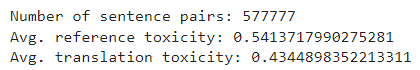
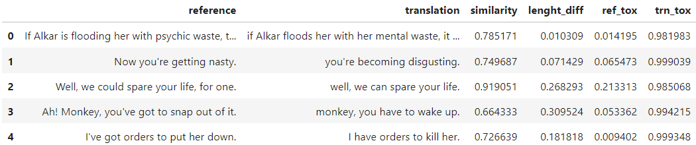
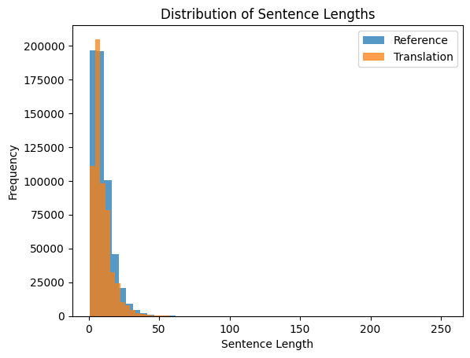
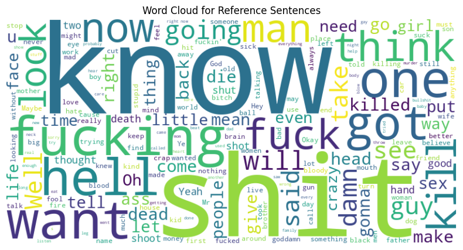
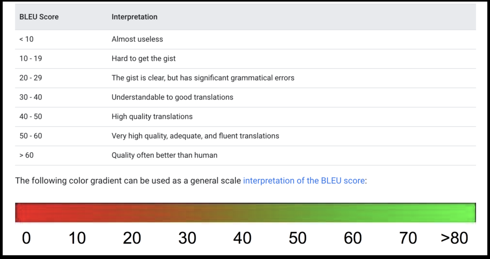
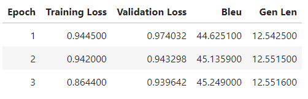
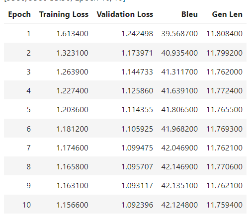
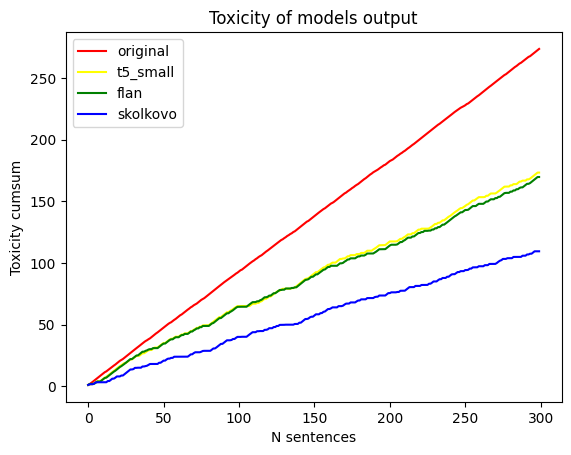
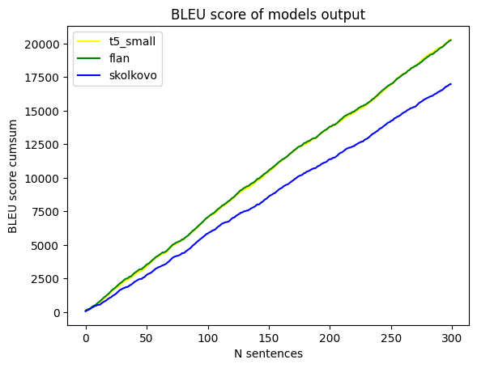

# Solution Building

# Introduction

After looking through the article provided in the task description and the 5th lab tnotebook that explained seq2seq model training, I decided to use a translational approach to this task. We can suppose that there are 2 languages: toxic and non-toxic and we would like to translate messages from one to another without loosing the initial meaning of the message.

# Dataset exploration

For this purposes I downloaded the filtered parmnt dataset provided to us and analysed it. 

After looking through several sample and writing the mean values of reference and translation I found out the dataset is mixed and the translation is not always less toxic than reference.

Because of that I decided to swap all sentences in such way that reference is always more toxic than translation, so later it’s easier for me to process it.  Since 500K+ pairs of sentences it too big for me to store(even if they are mostly ~10 words long) and use later in trainings and I needed to crop the data.

 So I sorted it firstly by translation toxicity and after that by similarity score. This result in a dataset where the most important metric is the text similarity, but in case of the same value less toxic translation is preferable. 

After that I simply take first 50k samples and save it as .tsv file for using later.

Here is the word cloud for reference texts (the most occuring words)

# T5 model family

T5 and BART models are the best model that I could get for my research experiments. There are several reasons for that.

- I have a limited resources, cannot actually use my own machine, so have to do everything via cloud services, but they are restricted by time and memory.
- T5 is an encoder-decoder model and converts all NLP problems into a text-to-text format. It is trained using teacher forcing. This means that for training, we always need an input sequence and a corresponding target sequence. So by definition it’s the most suitable model for the given data and problem description.
- BART is a transformer encoder-decoder (seq2seq) model. BART is particularly effective when fine-tuned for text generation (e.g. summarization, translation)
- T5 and BART is explored by large companies like google,facebook and Skolkovo, they have a variety of different versions, that I can compare. Moreover, T5 is the only model on hugging face that I could find in a small size
- They have a clear description on how to use it. Moreover, I was provided by a notebook example on how to fine-tune the T5 model

### Other models

This doesn’t mean that I didn’t try other model. However During my research I tried to use BERT, BART (frome facebook), ALBERT, GPT models in order to fine-tune them on the cropped dataset. However during the process I encountered a lot of problems with tokenization and data prerocessing, memory leaks. Some of them have ways to solve - like quantization (storing the weights in different data type in order to decrease its size) or usage of other cloud services, but I decided that this approach is not suitable with my abilities. Therefore I analysed work of two t5 models and BART model from skolkovo.

# T5-small

A classic basic example of t5 architecture. 

More information about this model you can find on [hugging face documentation](https://huggingface.co/docs/transformers/model_doc/t5) by looking at the associated papers. 

The training part is simple - I take the dataset, load the model and tokenizer from a checkpoint, process the dataset, choose arguments for training, run the autotrainer. Then I simply use [skolkovo toxicity classifier](https://huggingface.co/s-nlp/roberta_toxicity_classifier) to analyse the result. Initially I didn’t save a special csv file for comparing results with other models, that is why there are 2 .ipynb notebooks for the same model

# Google FLAN

This a T5 model tuned by the google, that they declare as more suitable for NLP tasks than a common one.

There is no much difference with training compared to T5 small. The only thing I want to note is that FLAN also has different model size, so I used the small one

# Skolkovo model

This model is really a big winner. First of all, unlike the other model it was fine-tune especially for the text detoxification problem, so I only could fine-tune to something more specific (you’ll se in the result section). Secondly, it was working even for it’s not hat big (compared to other NLP models) size, I didn’t had to compose a special structure for training it. 

# Discussions.

So, as I said in the introduction. When I prepared my dataset I sorted it by similarity, so the text of reference and translation are close enough. Here’s the definition of Bleu metric scores from the internet sources.

And here are the training mean values for different models

skolkovo:

T5-small

So this models by definition after fine-tuning started to give me a high quality translation, which is no surprise since I focused my dataset more on the similarity.

After training all models I decided to translate first 300 sentences from the cropped dataset to analyse how well they performed on the initial problem - detoxifying it. Here are the results

From this image you can see, that all models can decrease the toxicity of texts ( their cumsum of toxicity score given by [roberta model from skolkovo](https://huggingface.co/s-nlp/roberta_toxicity_classifier) is lower than from the original sentences) . But the skolkovo model ( that was actually made for detoxification) perofrms better.

However, when we are looking at the bleu score we can see, that th t5 model give more closer to the original text results (their bleu score is bigger) than skolkovo. This is due to the fact that the skolkovo model is too powerful and cut everything toxic, while my dataset is focused more on preserving the information. 

See the final result in my final [solution report](https://www.notion.so/Detoxification-Task-f978e900e9784df78e1baf34a3d94af8?pvs=21).