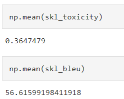
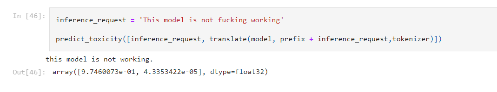
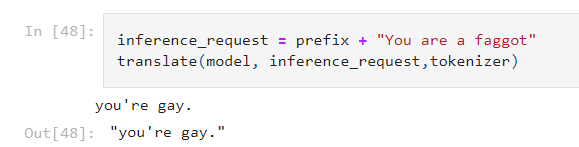

# Final Solution

# Dataset exploration

As I explained in the solution finding the dataset is initially mixed, so I firstly correct it.

Then I sort it in such way that similarity is more important and finally crop it to 50k examples.

# Model specification

This is a model from skolkovo research team. More info about it you can find in the paper (look in the reference folder). Since it’s uploaded to the hugging face - I can simply load it by a few lines of code.

# Training procedure

Nothing special compared to the examples given in the 5 lab (look in the reference folder) and just documentation of hugging face. I just simply use my cropped dataset for fine-tuning it.

# Evaluation

As I explained in the solution building for calculating toxicity I used roberta classifier model from skolkovo. Here are some metric scores on 300 sentence test set and a few of examples of translation.

computed toxicity of input and output (output is also printed) respectively

good translation from my point of view

# Results

Overall the model detoxifies better than T5 however, it was designed intentionally for it (while flan and T5-small are not). By using my special dataset I just tuned it more towards protecting the context, though decreasing performance for detoxification. In the future I can try to use another dataset, focus more on metrics results from other models or play with parameters of training. Moreover with a higher computational power I could try to train more powerfull models to comare the result. 

Nonetheless, all the models gave a fine result decreasing the toxicity at least by 30%, what is not so bad.